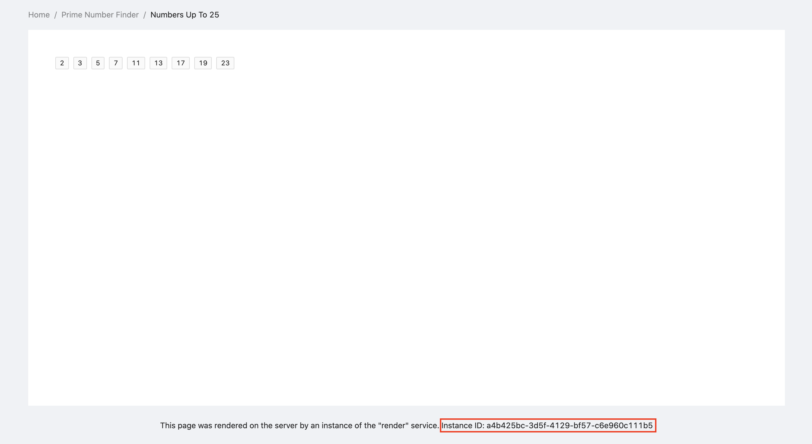
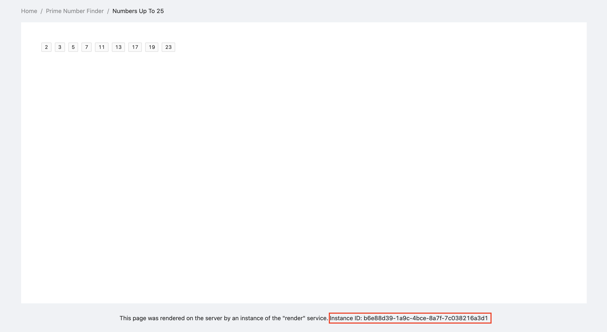

## Start Framework

We have everything in place so all we need to do now is execute the application to spin up our framework.

> Ensure no other processes are running on port `8080` and `8081` as defined by the configuration. Port `8080` allows you to access the running framework via HTTP or connect to the Risen.JS directly on port `8081` if you have a separate instance of Risen.JS running in `client` mode.

```sh
node index.js
```

After doing this you should see something like this in your terminal:

```
Risen.JS Micro Service Framework: x.x.x
Starting service core...
Service core started!
Attempting to connect to address: localhost:1024
Attempting to connect to address: localhost:1024
[Child process: stdout] Micro service - prime/port:1024/id:e5eb0bb9-9963-4b18-808c-22319790231d: Starting service on address: 1024
[Child process: stdout] Micro service - prime/port:1024/id:e5eb0bb9-9963-4b18-808c-22319790231d: Service started successfully!
...
```

> GUID's and port numbers may be different depending on your local environment.

If you do see this means everything is working, well done! If not please go back to the previous sections and double-check every step.

> Please note we are seeing this because we have `verbose: true` set in our framework options. We recommend in a production environment you would want to keep this `verbose: false`.

## Open Browser

Navigate to the following URL, this is where your _Express_ server is configured in this tutorial. Paste the following in a new tab:

```
http://localhost:8080
```

> If you have configured an alternate port number for your express server use that one instead.

You should see the initial landing page which looks like this:



Congratulations, everything is working as it should! Now notice the red box showing the instance which generated the HTML page. If you refresh the page you will see this GUID changing each time like so:



In our previous step we defined Risen.JS to initialize two identical instances of the `render` service:

```jsx
RisenInstance.defineService("render", "./services/render/index.jsx", {
  babelConfig: {
    presets: ["@babel/preset-env", "@babel/preset-react"]
  },
  instances: 2 // HERE
});
```

This is why you are seeing the GUID alternating between two values. This is how easy it is to deploy efficient, scalable, non-blocking Node.JS server-side based applications.

The services communicate with each other and also serve data to an external "client", in our case your browser. In theory, your client could be anything, another process on the machine, or even across the internet.

> As these are GUID's they will not be the same as the example in this documentation.

Let's up the amount we are calculating in this example:

```
http://localhost:8080/?prime=3000
```

Now you should see:


Risen.JS also works for use cases without a "client". For example, if you have tasks you wanted to automate in a backend, perhaps doing things like sending emails to customers, updating accounting records, automatically generating and posting social media posts you can define services to do all of this in Risen.JS.

This means you can **automate** a large number of daily business operations, streamlining your processes, reducing overhead, and cutting costs in the process.

Not let's give it a bigger workload. Let's calculate all the prime numbers up to one million. Paste this in your browser tab:

```
http://localhost:8080/?prime=1000000
```

After a short pause, you should have the result in your browser. Running this workload on a single thread would vastly increase the time to get a response.

Because we are splitting this workload between four service instances of `prime`, each one calculating an interval of 250000, and a separate service instance `render` dedicated to generating the HTML, we can perform fulfil the entire request much faster.

## Check Your Terminal

Let's have a look at the terminal. You should see _something_ like this:

```
[0] Sending data to: render
[0] Service core connection request recieved
[Child process: stdout] Micro service - render/port:1024/id:582877aa-aa18-4289-bfe6-caa698504caa: [0] Sending data to: prime
[Child process: stdout] Micro service - render/port:1024/id:582877aa-aa18-4289-bfe6-caa698504caa: [0] Sending data to: prime
[0] Sending data to: prime
[1] Service core connection request recieved
[2] Service core connection request recieved
[3] Service core connection request recieved
[4] Service core connection request recieved
[Child process: stdout] Micro service - render/port:1024/id:582877aa-aa18-4289-bfe6-caa698504caa: [0] Sending data to: prime
[Child process: stdout] Micro service - prime/port:1027/id:6c28ab2a-bf6d-477a-b038-e71103ba2239: [0] Service successfully processed command (getPrimeListFromRange) from render/port:1024/id:582877aa-aa18-4289-bfe6-caa698504caa
[Child process: stdout] Micro service - prime/port:1028/id:e397393c-f484-414f-b171-715b5afb7160: [0] Service successfully processed command (getPrimeListFromRange) from render/port:1024/id:582877aa-aa18-4289-bfe6-caa698504caa
[Child process: stdout] Micro service - prime/port:1025/id:8c4ee20d-56ce-4c8b-bfb0-793d6386975f: [0] Service successfully processed command (getPrimeListFromRange) from render/port:1024/id:582877aa-aa18-4289-bfe6-caa698504caa
[Child process: stdout] Micro service - prime/port:1029/id:5ca95ac1-8db4-49f0-bd9f-b966fced7b20: [0] Service successfully processed command (getPrimeListFromRange) from render/port:1024/id:582877aa-aa18-4289-bfe6-caa698504caa
[Child process: stdout] Micro service - render/port:1024/id:582877aa-aa18-4289-bfe6-caa698504caa: [0] Micro service has processed request for service: prime
[0] Micro service has processed request for service: prime
[0] Micro service has processed request for service: prime
[Child process: stdout] Micro service - render/port:1024/id:582877aa-aa18-4289-bfe6-caa698504caa: [0] Micro service has processed request for service: prime
[Child process: stdout] Micro service - render/port:1024/id:582877aa-aa18-4289-bfe6-caa698504caa: [0] Service successfully processed command (renderPage) from serviceCore/address:8081
[0] Service core has processed request for service: render
```

As you can see you can track the flow of data through the Risen.JS framework. _Your GUID's will be different as they are automatically generated._

## Request Lifecycle

It's important for this to not be too confusing so let's take a high-level overview of the lifecycle of your request:

1. You navigate to http://localhost:3000 and your browser sends a GET request to this address.
2. The express server receives the GET request from your browser.
3. The express server checks to see if it matches an HTTP route.
4. It finds the route and then executes the HTTP route handler for that route.
5. The HTTP route handler sends a request to the service core.
6. The service core receives the request and ensures it's valid.
7. The service core then sends the data to the `render` service, load-balanced via round-robin.
8. The `render` service received the requests and splits the workload into four parts.
9. The `render` service then sends four requests to the service core, the end destination being the `prime` service.
10. Again the service core validates all requests it's receiving from `render` service.
11. It then sends the requests to each of the `prime` services as requested by the `render` service.
12. All four `prime` services calculate their respective workloads and send the result back to the service core.
13. The service core validates the response and sends the results back to the `render` service.
14. The `render` service assembles all the results it's received from the `prime` services.
15. The `render` service then uses the result to generate static HTML markup.
16. It then sends this response back to the express server it originally received the request from.
17. The express server receives the response from the `render` service and sends it back to your browser.

> As you can see the service core is the master process in Risen.JS. It manages all the processes and coordinates cross-process communication as well as ensuring service instance health. If a service instance fails it will be automatically restarted for example.

Putting the step number against the line of output this is what we end up with:

```
[0] Sending data to: render // #5
[0] Service core connection request recieved // #6, #7
[Child process: stdout] Micro service - render/port:1024/id:582877aa-aa18-4289-bfe6-caa698504caa: [0] Sending data to: prime // #9
[Child process: stdout] Micro service - render/port:1024/id:582877aa-aa18-4289-bfe6-caa698504caa: [0] Sending data to: prime // #9
[0] Sending data to: prime // #9
[1] Service core connection request recieved // #10, #11
[2] Service core connection request recieved // #10, #11
[3] Service core connection request recieved // #10, #11
[4] Service core connection request recieved // #10, #11
[Child process: stdout] Micro service - render/port:1024/id:582877aa-aa18-4289-bfe6-caa698504caa: [0] Sending data to: prime // #9
[Child process: stdout] Micro service - prime/port:1027/id:6c28ab2a-bf6d-477a-b038-e71103ba2239: [0] Service successfully processed command (getPrimeListFromRange) from render/port:1024/id:582877aa-aa18-4289-bfe6-caa698504caa // #12, #13
[Child process: stdout] Micro service - prime/port:1028/id:e397393c-f484-414f-b171-715b5afb7160: [0] Service successfully processed command (getPrimeListFromRange) from render/port:1024/id:582877aa-aa18-4289-bfe6-caa698504caa // #12, #13
[Child process: stdout] Micro service - prime/port:1025/id:8c4ee20d-56ce-4c8b-bfb0-793d6386975f: [0] Service successfully processed command (getPrimeListFromRange) from render/port:1024/id:582877aa-aa18-4289-bfe6-caa698504caa // #12, #13
[Child process: stdout] Micro service - prime/port:1029/id:5ca95ac1-8db4-49f0-bd9f-b966fced7b20: [0] Service successfully processed command (getPrimeListFromRange) from render/port:1024/id:582877aa-aa18-4289-bfe6-caa698504caa // #12, #13
[Child process: stdout] Micro service - render/port:1024/id:582877aa-aa18-4289-bfe6-caa698504caa: [0] Micro service has processed request for service: prime  // #14
[0] Micro service has processed request for service: prime // #14
[0] Micro service has processed request for service: prime // #14
[Child process: stdout] Micro service - render/port:1024/id:582877aa-aa18-4289-bfe6-caa698504caa: [0] Micro service has processed request for service: prime  // #14
[Child process: stdout] Micro service - render/port:1024/id:582877aa-aa18-4289-bfe6-caa698504caa: [0] Service successfully processed command (renderPage) from serviceCore/address:8081  // #15
[0] Service core has processed request for service: render // #16, #17
```

> Risen.JS is an asynchronous event-driven by design meaning the logs won't always correspond to when the happens.

## Persistent Connections

Risen.JS maintains **persistent connections** with all instances and express servers so there is no connection initialization latency involved in communication.

It may appear that sending everything via the service core may slow things down, the important thing to remember is if service instances were messaging each other directly there would be greater complexity and potential concurrency issues.

The state of the entire instance and its services would need to be synchronized between multiple services all at once. This means you would have a "state" spread across multiple independent services instances (separate processes essentially), not to mention the fact this "state" could be out of date at any point.

If a service exits unexpectedly all the running services would need to be informed of this, raising the risk of unexpected race conditions and pitfalls.

For example, the service core operations allow dynamic scaling of service instances and if it were to reduce the number while another service is communicating with it you would begin to get unexpected behaviour and less reliability.

Having everything flow through the service core ensures that the framework has a single source of truth and if a service instance fails, for example, for any reason the other service instances do not need to be aware of this.

The service core would simply route any new requests to the remaining service instances, while it restarts the failed service instance. If there are no remaining processes the service core would queue the requests coming in and send them when the service instance is back up.

For these few reasons and many more, this is why the Risen.JS framework has taken this approach.

## Final Notes

It’s worth noting that this framework _intentionally_ has a function that blocks the event loop while calculating the prime numbers as well as using `renderToString` which is also synchronous.

This is to demonstrate that blocking service will not stop Risen.JS from serving content and routing requests to their destinations.

Of course, you should design your services in a way that does not block your service instances from receiving and processing new requests. Forking computationally expensive operations via the `cluster` module is one way to deal with this as well as using strictly asynchronous methods.

That's it for now, feel free to put the application through its paces, or if you're ready to learn more go to the next section to dive into the API documentation.
